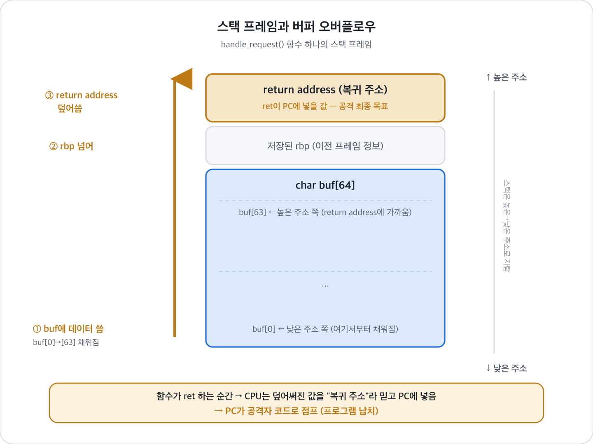

# 인터넷과 네트워크를 감염시키는 버퍼 오버플로우

## 0. 한 줄 요약

> **정해진 크기의 상자(버퍼)에 그보다 많은 물건(데이터)을 넣으면 옆칸을 덮어쓴다.**
> 그 "옆칸"에 하필 **프로그램이 다음에 갈 주소**가 들어있어서, 공격자가 프로그램을 자기가 원하는 코드로 납치할 수 있다.

---

## 1. 가장 중요한 대전제: 컴퓨터는 코드와 데이터를 구분 못 한다

컴퓨터 메모리에는 **명령어(코드)** 와 **데이터** 가 같이 들어있습니다.
그런데 CPU는 메모리 속 어떤 바이트가 "실행할 명령어"인지 "그냥 저장된 값"인지 **구분하지 못합니다.**

- CPU는 그냥 "지금 여기 가리키는 주소" 의 바이트를 명령어라고 믿고 실행할 뿐이에요.
- 이 "지금 여기" 를 가리키는 게 **PC(Program Counter)** 입니다.

그래서 공격자의 목표는 항상 하나:
**"내가 넣은 데이터를 CPU가 명령어로 실행하게 만들자"** 또는 **"프로그램이 갈 주소를 내가 정하자"**

---

## 2. 비유로 이해하기

버퍼 = **정해진 칸 수의 사물함**이라고 생각해봅시다.

```
[ 신발장 64칸 ]  [ 관리인이 적어둔 "퇴근 후 갈 집 주소" ]
```

- 원래는 신발장 64칸에 신발만 넣어야 함.
- 그런데 누가 신발을 100켤레 욱여넣으면?
- 신발장을 넘쳐서 **옆에 붙어있는 "집 주소" 메모까지 덮어써 버림.**
- 이제 관리인은 퇴근할 때 (덮어써진) 엉뚱한 주소로 감.
- 공격자가 그 주소 자리에 **자기 집 주소(=공격 코드 위치)** 를 적어두면?
  → 관리인(프로그램)이 공격자가 원하는 곳으로 끌려감.

여기서
- **신발장 64칸** = `char buf[64]` 같은 버퍼
- **집 주소 메모** = 함수가 끝나고 돌아갈 **return address(복귀 주소)**

---

## 3. 코드로 보기

```c
void handle_request(int sock) {
    char buf[64];              // 64바이트짜리 상자
    read(sock, buf, 4096);     // 근데 네트워크에서 최대 4096바이트를 읽음!
    ...
}
```

- `buf`는 **64칸**밖에 없는데 **4096칸**을 받아버림.
- 넘친 데이터가 옆에 있는 **return address(복귀 주소)** 를 덮어씀.
- 함수가 끝날 때 CPU는 덮어써진 주소로 점프 → **공격자가 원하는 코드 실행.**

이렇게 스택의 return address를 덮어쓰는 고전 기법을 **스택 스매싱(stack smashing)** 이라고 부릅니다.

---

## 3.5. return address(복귀 주소)는 대체 "언제" 생기나? (백엔드 시야로)

백엔드 개발자 입장에선 이게 제일 안 와닿을 거예요. 결론부터:

> **return address는 특별한 상황이 아니라, "함수를 호출할 때마다" 자동으로 생긴다.**

### 왜 생기냐면
당신이 이런 코드를 짰다고 합시다.

```python
def handle_request():
    data = parse_body()   # ← 여기서 잠깐 다른 함수로 떠남
    save_to_db(data)      # ← 여기서도 다른 함수로 떠남
    return response
```

`parse_body()` 를 호출하면 CPU는 그 함수 코드로 점프합니다.
그런데 `parse_body()` 가 끝나면 **"원래 하던 handle_request의 어디로 돌아가야 하지?"** 를 알아야 하죠.

그래서 CPU는 함수를 부르기 직전에 **"돌아올 주소"를 스택에 적어둡니다.** 이게 return address예요.

```
handle_request 실행 중
   └─ parse_body() 호출  → 스택에 "save_to_db 줄로 돌아와" 라고 적어둠 (return address)
        └─ parse_body 끝  → 적어둔 주소 보고 정확히 그 줄로 복귀
```

### 백엔드 비유: 함수 호출 = 콜스택(Call Stack)
에러 터졌을 때 보는 **스택 트레이스(stack trace)** 기억나시죠?

```
  at save_to_db (db.py:42)
  at handle_request (server.py:15)   ← 여기로 돌아가야 함
  at main (app.py:3)
```

이 스택 트레이스가 바로 **return address들이 쌓여있는 스택을 사람이 읽기 좋게 보여준 것**입니다.
즉 return address는 이미 당신이 매일 보던 개념이에요. **함수 하나 부를 때마다 하나씩 쌓이는 "돌아갈 주소"** 입니다.

### 그럼 "스택"은 대체 뭔데? (OS·하드웨어 관점)

여기서 스택을 하드웨어 관점으로 보면 **"메모리의 한 영역"** 입니다. 정확히는 함수 호출 정보를 쌓아두는 전용 공간이에요.

프로그램이 실행되면 OS는 그 프로세스의 메모리를 몇 개 구역으로 나눠줍니다. 코드가 사는 곳, 전역 데이터가 사는 곳, 그리고 **함수 호출 때마다 쓰는 임시 메모리 = 스택**이 있어요. 이름 그대로 **접시 쌓듯(LIFO)** 동작합니다.

- 함수를 **부르면** → 그 함수 전용 칸(**스택 프레임, stack frame**)이 하나 **쌓이고(push)**
- 함수가 **끝나면** → 그 칸이 **치워집니다(pop)**

그리고 이 스택 프레임 하나 안에는 세 가지가 같이 들어갑니다:

1. 그 함수의 **지역 변수** (← 바로 `char buf[64]`가 여기 삽니다)
2. 이전 프레임 정보 (저장된 베이스 포인터 `rbp` 등)
3. **return address (복귀 주소)**



*스택 프레임 — `buf[64]`와 `return address`가 같은 프레임 안 이웃에 있고, 스택은 높은→낮은 주소로 자라는데 배열은 반대로 채워진다. 그래서 buf가 넘치면 위쪽의 return address까지 덮인다.*

핵심은 **`buf[64]`와 `return address`가 같은 프레임 안에, 바로 옆에** 놓여 있다는 거예요. 게다가 스택은 보통 **높은 주소 → 낮은 주소** 방향으로 자라는데, 배열은 반대로 **낮은 주소 → 높은 주소** 방향으로 채워집니다. 그래서 `buf`에 64칸을 넘겨 데이터를 쓰면, 넘친 바이트가 **위쪽으로 흘러넘쳐 저장된 rbp를 지나 return address까지 덮어씁니다.**

### 그래서 공격이 성립하는 지점
- 함수 안에서 선언한 지역변수(버퍼)와 return address는 **같은 스택에 나란히** 있음.
- 버퍼를 넘치게 하면 → 바로 옆의 return address를 덮어씀 →
- 함수가 끝나면서(`ret`) CPU는 덮어써진 그 값을 "복귀 주소"라 믿고 PC에 넣어 → **"돌아갈 주소"가 아니라 "공격자가 심어둔 주소"로 점프.**

정리: **return address는 함수 호출마다 항상 생긴다. 문제는 그게 사용자 입력을 담는 버퍼 바로 옆에 있다는 것.**

---

## 3.6. 네트워크 요청이 어떻게 이 버퍼까지 도달하나 (전체 여정)

백엔드에서 `request.body` 하나 받는 게, 사실은 이 긴 여정의 끝입니다.

```
[클라이언트]
   │  1. HTTP 요청 전송 (POST /login, body에 데이터)
   ▼
[TCP/IP 로 쪼개짐]  요청이 여러 개의 패킷으로 나뉘어 인터넷을 건너감
   ▼
[서버의 NIC(랜카드)]  2. 패킷 도착
   ▼
[OS 커널]  3. 패킷을 조립해서 "소켓(socket)" 의 수신 버퍼에 쌓아둠
   ▼
[당신의 서버 코드]  4. read(sock, buf, ...) / recv() 로 그 데이터를 읽어옴  ← 여기!
   ▼
[핸들러 함수]  5. buf 에 담긴 요청을 파싱해서 처리
```

### 문제가 터지는 곳은 정확히 4번
당신이 쓰는 프레임워크(Spring, Express, Django...)는 내부적으로 이렇게 동작해요.

```c
// 프레임워크/웹서버 내부 (보통 C로 짜여있음)
char buf[1024];
int n = recv(client_sock, buf, 8192, 0);   // 소켓에서 데이터를 buf로 읽음
```

- **소켓(socket)** = 네트워크로 들어온 데이터가 도착하는 "구멍/파이프". 백엔드에서 포트 열고 `listen` 하는 그거요.
- `recv()` / `read()` = 그 구멍에서 데이터를 꺼내 **버퍼에 담는 순간.**
- 이때 **"버퍼 크기(1024)보다 큰 데이터(8192)를 그대로 담으면"** → 4번에서 오버플로우 발생.

### 왜 "네트워크"가 특별히 위험한가?
- 로컬 프로그램은 입력이 내 손안(파일, 키보드)이라 통제 가능.
- **네트워크 입력은 지구 반대편의 낯선 공격자가 보낸 것.** 크기도, 내용도 마음대로 조작 가능.
- 즉 **"신뢰할 수 없는 입력(untrusted input)이 곧장 버퍼로 들어온다"** 는 게 핵심 위험.
- 그래서 이 취약점이 **원격(remote)** 에서 터지면, 공격자가 서버에 로그인도 없이 코드를 실행함 → **RCE(원격 코드 실행).** 백엔드에서 제일 무서운 등급의 취약점이에요.

> 백엔드 한 줄 요약:
> **"클라이언트가 보낸 request body → 소켓 → recv() → 버퍼" 이 길목에서, 버퍼 크기 검사를 안 하면 오버플로우가 나고, 그게 원격 코드 실행이 된다.**
> 그래서 항상 **입력 길이 검증(Content-Length 제한, 버퍼 경계 검사)** 이 백엔드 보안의 기본인 것.

---

## 4. 그런데 이게 어떻게 "인터넷 전체"를 감염시킬까? (웜의 원리)

버퍼 오버플로우 하나로 남의 서버에서 내 코드를 실행시켰다고 칩시다. 그다음:

1. 내 코드가 남의 서버에서 실행됨 → **원격 코드 실행(RCE) 성공**
2. 그 코드가 **다른 취약한 서버들을 스캔**함 (아무 IP나 찔러봄)
3. 취약한 서버 발견하면 **똑같은 공격을 그 서버에 또 쏨**
4. 감염된 서버가 다시 2번부터 반복...

이렇게 **사람 손 없이 스스로 복제하며 퍼지는 프로그램**을 **웜(Worm)** 이라고 합니다.

```
1대 → 2대 → 4대 → 8대 → 16대 → ...  (기하급수적 폭증)
```

한 대가 여러 대를 감염시키니까 **감염 속도가 지수함수**가 됩니다.
그래서 "몇 시간, 심하면 몇 분 만에 인터넷 마비" 같은 일이 실제로 일어났어요.

---

## 5. 실제 역사적 사례

| 사례 | 연도 | 어디를 넘치게 했나 | 왜 유명한가 |
|---|---|---|---|
| **모리스 웜 (Morris Worm)** | 1988 | `fingerd` 프로그램의 `gets()` 버퍼 | **최초의 인터넷 웜.** 당시 인터넷의 약 10% 마비. (CSAPP 1장에 나오는 그 사건) |
| **코드 레드 (Code Red)** | 2001 | 마이크로소프트 IIS 웹서버 버퍼 | 14시간 만에 약 35만 대 감염 |
| **SQL 슬래머 (SQL Slammer)** | 2003 | MS SQL 서버, 패킷 딱 하나(376바이트) | **10분 만에** 전 세계 취약 서버 대부분 감염. 역대 최고 확산 속도 |
| **컨피커 (Conficker)** | 2008 | 윈도우 서비스 버퍼 오버플로우 | 수백만~천만 대 감염 봇넷 |

### 왜 SQL 슬래머는 "10분"밖에 안 걸렸나?
- 공격 코드가 **패킷 하나(376바이트)** 에 다 들어감.
- **UDP**를 써서 연결 과정(악수, 핸드셰이크) 없이 그냥 쏘고 감 → 대기 시간 0.
- 감염되자마자 아무 IP에나 자기 자신을 복사해 뿌림.
- 결국 확산 속도가 **네트워크 속도에만 걸림** → 그래서 순식간.

여기서 얻는 이론 포인트:
**연결 방식(TCP vs UDP), 패킷 크기, 스캔 전략이 웜의 확산 속도를 결정한다.**

---

## 6. 요즘은 왜 예전만큼 안 통할까? (방어 3종 세트)

실습하다 막혔던 이유가 대부분 아래 셋 때문입니다.

### ① 스택 카나리 (Stack Canary)
- 버퍼와 return address 사이에 **랜덤한 감시 값**을 몰래 심어둠.
- 오버플로우로 return address를 덮으려면 이 값도 같이 덮게 됨.
- 함수 끝날 때 값이 바뀌었으면 → **"공격이다!" 하고 프로그램을 즉시 종료.**
- (탄광의 카나리아처럼 위험을 먼저 알려준다는 의미)

### ② DEP / NX bit (실행 금지)
- 메모리에 "여긴 **쓰기**만 되고 **실행**은 안 됨" 이라고 표시.
- 스택에 공격 코드를 넣어도 **실행 자체가 차단됨.**
- 원칙: **쓸 수 있는 곳은 실행 못 하고, 실행되는 곳은 못 쓴다 (W⊕X)**

### ③ ASLR (주소 랜덤화)
- 스택·라이브러리 등의 주소를 **실행할 때마다 랜덤하게 바꿈.**
- 공격자가 "이 주소로 점프해!" 하고 미리 적어둬도, 그 주소가 매번 달라서 못 맞춤.

### 공격자의 반격: ROP (Return-Oriented Programming)
- NX 때문에 새 코드를 못 넣게 되자,
- **이미 프로그램에 있는 코드 조각(gadget)들의 주소**를 return address에 줄줄이 엮음.
- "새 코드를 실행"하는 게 아니라 **"기존 코드를 재조합해 실행"** → NX 우회.

> 이 분야 이론의 뼈대 = **창과 방패의 역사**
> `스택에 코드 실행` → `NX가 막음` → `ROP로 우회` → `ASLR/카나리로 다시 방어` ...

---

## 6.5. Python / Java에서는 왜 이게 안 될까? (아주 중요!)

> **핵심: 고전적 버퍼 오버플로우는 사실상 "C(그리고 C++)의 문제"다.**
> Python, Java는 애초에 **넘치지 못하게 막아버리기** 때문에 안 일어난다.

### C가 위험한 이유
C는 배열 크기를 **아무도 검사하지 않는다.** 64칸 상자에 100개를 넣어도 그냥 넣어짐.

```c
char buf[64];
buf[100] = 'A';   // 에러 안 남! 그냥 옆 메모리를 덮어씀 (재앙의 시작)
```

### Python은? → 실행 중에 검사하고 튕겨냄

```python
buf = [0] * 64      # 64칸 리스트
buf[100] = 65       # IndexError: list assignment index out of range 
```

- 파이썬은 배열(리스트)에 접근할 때마다 **"이 인덱스가 범위 안이야?"** 를 매번 검사함.
- 범위를 벗어나면 **덮어쓰는 게 아니라 예외를 던지고 멈춤.**
- 문자열도 마찬가지로 **길이를 자동 관리**해서, 넘치는 개념 자체가 없음.

### Java도? → 똑같이 검사하고 예외 던짐

```java
byte[] buf = new byte[64];
buf[100] = 65;   // ArrayIndexOutOfBoundsException: Index 100 out of bounds 
```

### 왜 C만 안 막고 Python/Java는 막을까?

| | C | Python / Java |
|---|---|---|
| **메모리 관리** | 개발자가 직접 (수동) | 언어/런타임이 자동 관리 |
| **배열 범위 검사** | X 안 함 (그래서 빠름) | O 접근할 때마다 검사 |
| **포인터로 아무 주소 접근** | O 가능 (그래서 위험) | X 원칙적으로 불가 |
| **속도** | 매우 빠름 | 검사 비용 때문에 상대적으로 느림 |
| **별명** | "unsafe language" | **"메모리 안전(memory-safe) 언어"** |

정리하면, C는 **"검사 안 하고 빠르게"** 를 택한 대가로 버퍼 오버플로우에 노출된 것이고,
Python/Java는 **"매번 검사해서 안전하게"** 를 택한 대신 약간의 속도를 내준 겁니다.

### 그럼 Python/Java는 완전 안전한가? (주의)
- **직접적인 스택 스매싱은 없다.** 하지만 이 언어들의 **인터프리터/가상머신(JVM)은 C/C++로 만들어져 있음.**
- 그래서 **Python/Java 자체의 버그가 아니라, 그 밑을 받치는 C 엔진의 버그**로 오버플로우가 터질 수 있음.
- 또 요즘 공격은 오버플로우 대신 **역직렬화 취약점, SQL 인젝션, 라이브러리 취약점** 쪽으로 많이 옮겨감. (예: Java의 Log4Shell)

> 그래서 요즘 구글·MS·미국 정부까지 **"새 코드는 Rust 같은 메모리 안전 언어로 쓰자"** 고 권고하는 게 바로 이 맥락입니다.

---

## 7. 최종 정리

1. 컴퓨터는 **코드와 데이터를 구분 못 한다** → 데이터가 코드가 될 수 있다.
2. 버퍼(상자)에 넘치게 넣으면 **옆칸(복귀 주소)** 를 덮어쓴다.
3. 복귀 주소를 조작해 **프로그램 실행 흐름을 납치**한다.
4. 그 코드가 **스스로 복제·전파**하면 그게 **웜**, 그래서 네트워크가 감염된다.
5. 오늘날은 **카나리 · NX · ASLR** 로 막지만, **ROP** 같은 우회 기법과 계속 싸우는 중.
