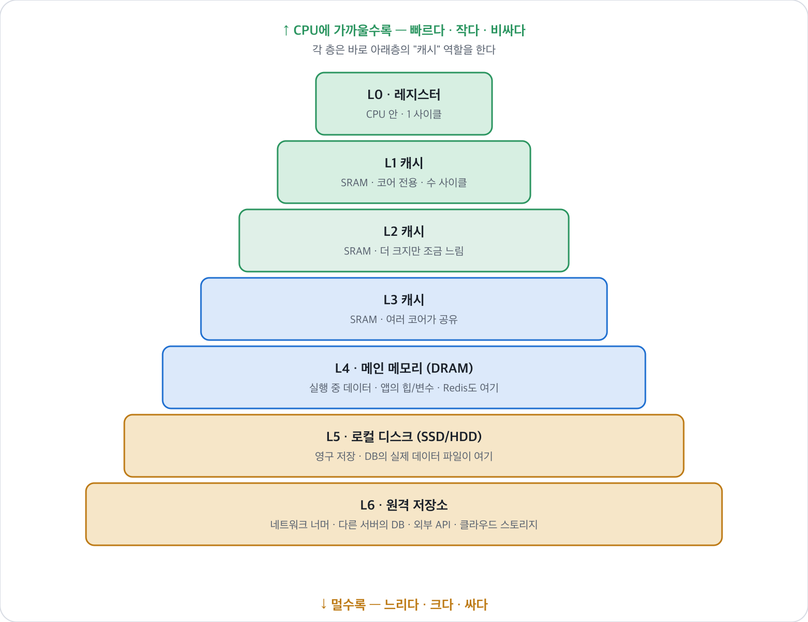
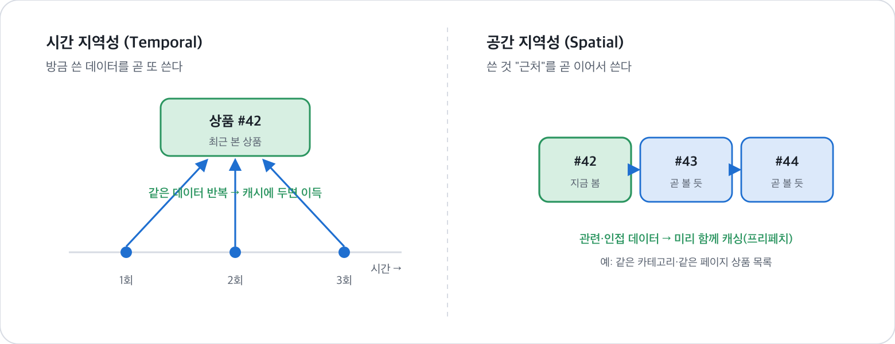
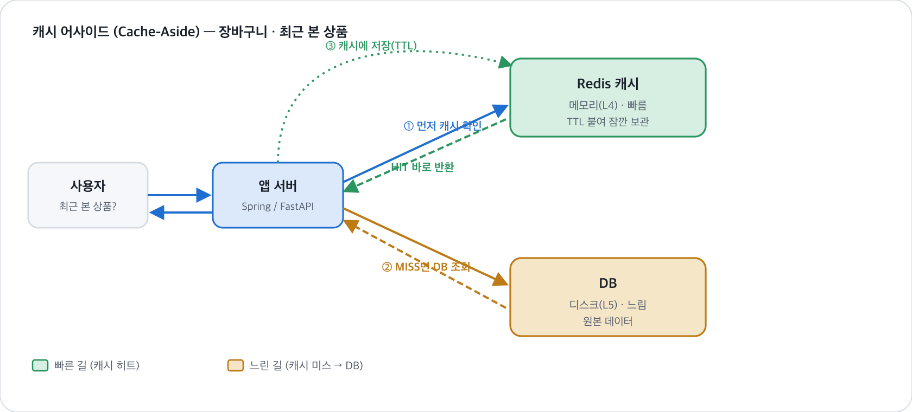

# 저장 장치의 계층 구조 — 캐시와 지역성

> 레지스터부터 원격 저장소까지, 저장장치는 **속도-크기-가격의 트레이드오프**를 따라 층층이 쌓여 있다.
> 그리고 이 하드웨어 원리가 백엔드의 **Redis 캐시**(장바구니·최근 본 상품)에 그대로 살아 있다.

**연결:** CSAPP 1.5(저장장치 계층) → 실무 캐싱 · **예제:** 장바구니 · 최근 본 상품 (Spring Boot / FastAPI)

### 목차
1. [왜 "계층"이 필요한가](#1-왜-계층이-필요한가)
2. [L0 → L6 저장장치 계층](#2-l0--l6-저장장치-계층)
3. [핵심 아이디어 — 각 층은 아래층의 캐시다](#3-핵심-아이디어--각-층은-아래층의-캐시다)
4. [지역성(Locality) — 캐시가 통하는 이유](#4-지역성locality--캐시가-통하는-이유)
5. [백엔드에 그대로 — 장바구니·최근 본 상품 캐싱](#5-백엔드에-그대로--장바구니최근-본-상품-캐싱)
6. [캐시의 함정 — 무효화·TTL·일관성](#6-캐시의-함정--무효화ttl일관성)
7. [정리](#7-정리)

---

## 1. 왜 "계층"이 필요한가

저장장치에는 넘을 수 없는 **트레이드오프**가 있다.

> **빠른 저장장치는 비싸고 작다. 싼 저장장치는 크지만 느리다.**

- CPU 레지스터는 눈 깜짝할 새(1 사이클)에 읽지만, 용량이 겨우 수십 개뿐이고 매우 비싸다.
- 디스크는 TB 단위로 싸게 담지만, 레지스터보다 **수백만 배** 느리다.

그래서 하나로는 답이 없다. 대신 **빠른 걸 조금, 느린 걸 많이** 겹쳐 쌓아서,
"자주 쓰는 건 위(빠른 곳)에, 나머지는 아래(느린 곳)에" 두는 전략을 쓴다. 이게 **저장장치 계층구조**다.

---

## 2. L0 → L6 저장장치 계층



*저장장치 계층 — 위(레지스터)일수록 빠르고 작고 비싸며, 아래(원격)일수록 느리고 크고 싸다. 각 층은 아래층의 캐시다.*

| 층 | 장치 | 위치 | 속도(상대) | 백엔드에서 |
|---|---|---|---|---|
| **L0** | 레지스터 | CPU 안 | 1 (기준) | 계산 중인 값 |
| **L1** | L1 캐시 | 코어 전용 | 수배 | — (하드웨어 자동) |
| **L2** | L2 캐시 | 코어 | 십수 배 | — (하드웨어 자동) |
| **L3** | L3 캐시 | 코어 공유 | 수십 배 | — (하드웨어 자동) |
| **L4** | 메인 메모리(DRAM) | 메모리 버스 | 수백 배 | 앱의 힙·변수, **Redis** |
| **L5** | 로컬 디스크(SSD) | I/O 버스 | 수만~수십만 배 | **DB의 데이터 파일** |
| **L6** | 원격 저장소 | 네트워크 너머 | 그 이상 | 다른 서버 DB·외부 API·S3 |

> **주목:** L1~L3 캐시는 **하드웨어가 알아서** 관리한다(우리가 손 못 댐).
> 하지만 L4(메모리) ↔ L5(디스크)의 관계 — **"느린 디스크 대신 빠른 메모리에 자주 쓰는 걸 올려두기"** — 는
> 백엔드에서 우리가 **직접** 하는 일이다. 그게 바로 Redis 캐시다.

---

## 3. 핵심 아이디어 — 각 층은 아래층의 캐시다

계층구조의 마법은 딱 한 문장이다.

> **위층은 바로 아래층의 "캐시(cache)"다.**
> 즉 아래층 데이터 중 **자주 쓸 것 같은 일부만** 위층에 미리 복사해 둔다.

- L1은 L2의 캐시, L2는 L3의 캐시, … L4(메모리)는 L5(디스크)의 캐시.
- CPU가 데이터를 찾을 때: **위층부터 뒤진다.** 있으면 → **히트(hit)**, 빠르게 끝. 없으면 → **미스(miss)**, 아래층까지 내려가서 가져오고 **위층에도 복사**해 둔다.
- 그래서 "다음에 또 찾으면" 이번엔 위층에서 바로 나온다.

**백엔드로 번역하면 완전히 똑같다:**
- Redis(메모리·위층)는 DB(디스크·아래층)의 캐시.
- 요청 오면 Redis부터 확인 → 있으면 히트(빠름), 없으면 DB 갔다 와서 Redis에도 넣어둠.

> 하드웨어의 "메모리는 디스크의 캐시" 원리를, 백엔드가 "Redis는 DB의 캐시"로 그대로 흉내 낸 것.

---

## 4. 지역성(Locality) — 캐시가 통하는 이유

"자주 쓸 것 같은 일부만 올려둔다"는 게 왜 먹힐까? 프로그램의 접근 패턴에
**지역성(locality)** 이라는 경향이 있기 때문이다. 두 종류가 있다.



*지역성 — 시간 지역성(같은 걸 또 씀)과 공간 지역성(근처 걸 이어 씀). 둘 다 "위층에 올려둔 일부가 실제로 자주 쓰이게" 만든다.*

### ① 시간 지역성 (Temporal Locality)
> **방금 쓴 데이터를 곧 또 쓸 확률이 높다.**

- 예: 사용자가 방금 본 **상품 #42**를 새로고침하거나 다시 클릭할 가능성이 높다.
- → 그 상품을 캐시에 잠깐 올려두면, 다음 요청은 DB 안 가고 캐시에서 즉시.

### ② 공간 지역성 (Spatial Locality)
> **쓴 데이터의 "근처(관련된 것)"를 곧 이어서 쓸 확률이 높다.**

- 예: 상품 #42를 본 사람은 **같은 카테고리의 #43, #44**도 볼 가능성이 높다.
- → 하드웨어는 데이터를 **블록 단위**로 통째로 가져와 근처 것까지 미리 캐싱한다.
- → 백엔드도 "상품 상세 하나 요청" 시 **연관 목록·같은 페이지 항목을 미리 함께 캐싱**(프리페치)할 수 있다.

> 캐시가 이득인 이유 = **지역성 덕분에 "위층에 올려둔 일부"가 실제로 자주 쓰인다.**
> 지역성이 없다면(매번 완전 랜덤 접근) 캐시는 무용지물이다.

---

## 5. 백엔드에 그대로 — 장바구니·최근 본 상품 캐싱

이제 실무. "최근 본 상품"은 보통 DB(느린 L5)에 있지만, 자주 조회되니
**Redis(빠른 L4)에 올려두는** 게 정석이다. 이 흐름을 **캐시 어사이드(Cache-Aside)** 패턴이라 한다.



*캐시 어사이드 — ① Redis 먼저 확인 → 있으면(HIT) 바로 반환, 없으면(MISS) DB 조회 후 ③ 캐시에 저장(TTL)하고 반환.*

동작 순서:
1. 앱이 **Redis 먼저** 확인한다.
2. **히트**면() → 캐시 값 바로 반환. DB 안 감. (시간 지역성 덕에 이 경우가 많음)
3. **미스**면() → DB 조회 → 그 결과를 **Redis에 저장(TTL 붙여서)** → 반환.
4. 다음 같은 요청부터는 히트.

### 예제 ① Spring Boot — `@Cacheable` (선언형)

```java
@Cacheable(value = "recentProducts", key = "#userId")
public List<Product> getRecentlyViewed(Long userId) {
    // 이 메서드 본문은 "캐시 미스일 때만" 실행된다
    return productRepository.findRecentByUser(userId);  // DB(L5) 조회
}

// 새 상품을 보면 캐시를 갱신/무효화
@CacheEvict(value = "recentProducts", key = "#userId")
public void addRecentlyViewed(Long userId, Product p) {
    recentRepository.save(userId, p);
}
```
- `@Cacheable`: 캐시에 있으면 메서드를 **아예 실행 안 하고** 캐시값 반환(히트). 없으면 실행 후 결과를 캐시에 저장(미스).
- Redis를 캐시 저장소로 연결하면, 이 어노테이션 하나가 위 그림 전체를 대신해 준다.

### 예제 ② FastAPI — 수동 캐시 어사이드

```python
import json

async def get_recently_viewed(user_id: int):
    key = f"recent:{user_id}"

    cached = await redis.get(key)          # ① Redis 먼저 확인
    if cached:                             # ② 히트 
        return json.loads(cached)

    rows = await db.fetch_recent(user_id)  # ③ 미스  → DB(L5) 조회
    await redis.set(key, json.dumps(rows),
                    ex=300)                # ④ 캐시에 저장 (TTL 300초)
    return rows
```

### 예제 ③ 장바구니 — Redis에 아예 얹기

장바구니는 조회·수정이 매우 잦아서, DB 대신 **Redis를 주 저장소처럼** 쓰기도 한다(Hash 자료구조).

```python
# 담기: 상품 42를 2개
await redis.hset(f"cart:{user_id}", "42", 2)
# 조회: 장바구니 전체
items = await redis.hgetall(f"cart:{user_id}")
```
- 장바구니는 "방금 담고 곧 또 본다"는 **시간 지역성**이 극단적으로 강한 데이터라 캐시에 딱 맞는다.
- 결제 시점에만 DB로 옮겨 영구 저장(디스크 L5)하면 된다.

---

## 6. 캐시의 함정 — 무효화·TTL·일관성

캐시는 공짜가 아니다. **"위층의 복사본이 아래층 원본과 달라질 수 있다"** 는 문제가 생긴다.

- **일관성(Consistency):** DB에서 가격이 바뀌었는데 Redis엔 옛 가격이 남아 있으면? → 사용자에게 틀린 값.
  → 데이터가 바뀔 때 캐시를 **무효화(evict)** 하거나 갱신해야 한다. (`@CacheEvict`, `redis.delete`)
- **TTL(Time To Live):** 캐시에 유효기간을 붙인다(예: 300초). 시간이 지나면 자동 삭제 → 다음 요청은 미스 → DB에서 최신값을 다시 채움. **"틀린 값이 남아도 오래 못 간다"** 는 안전장치.
- **캐시 스탬피드:** 인기 데이터의 캐시가 동시에 만료되면 요청이 한꺼번에 DB로 몰림 → TTL 분산, 락 등으로 완화.

> **트레이드오프:** 캐시는 **속도**를 얻는 대신 **최신성(정합성)** 을 일부 포기한다.
> "얼마나 오래된 값까지 허용되나"(TTL)를 데이터 성격에 맞게 정하는 게 캐싱 설계의 핵심.
> (가격·재고 = 짧게 / 최근 본 상품 = 길게 / 거의 안 변하는 카테고리 = 아주 길게)

---

## 7. 정리

1. 저장장치는 **속도↓·크기↑·가격↓** 순으로 **L0(레지스터) → L6(원격)** 층층이 쌓여 있다.
2. **위층은 아래층의 캐시** — 자주 쓸 일부만 빠른 위층에 복사해 두고, 없으면(미스) 아래에서 가져온다.
3. 이게 통하는 이유는 **지역성** — 방금 쓴 걸 또 쓰고(시간), 근처 걸 이어 쓴다(공간).
4. 하드웨어의 "메모리는 디스크의 캐시"를, 백엔드가 **"Redis는 DB의 캐시"** 로 그대로 재현한다.
5. 장바구니·최근 본 상품은 **시간 지역성이 강해** 캐싱에 딱 맞고, **캐시 어사이드** 패턴으로 구현한다.
6. 대가는 **정합성** — 무효화·TTL로 "오래된 복사본" 문제를 관리해야 한다.

> **한 문장으로:** 캐시는 하드웨어가 수십 년 써온 "자주 쓰는 건 가까이, 빠르게" 전략이고,
> 백엔드의 Redis는 그 전략을 DB 앞에 한 겹 더 깐 것이다.

---

*컴퓨터 시스템 1장 학습 노트 · 저장장치 계층구조 → 백엔드 캐싱*
*예제 스택 — Spring Boot(@Cacheable) · FastAPI(redis) · Redis(L4 메모리) · DB(L5 디스크)*
