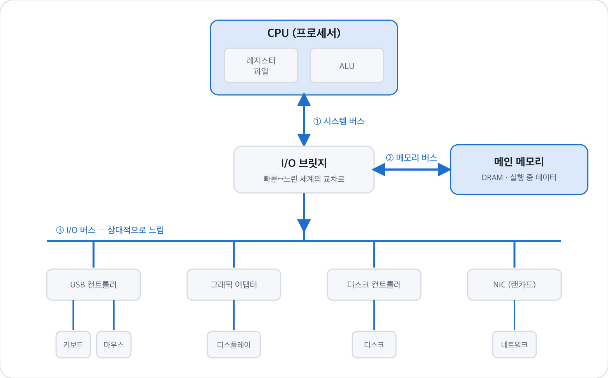
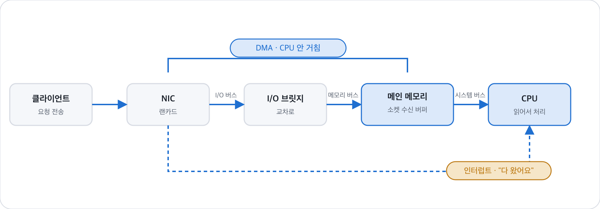
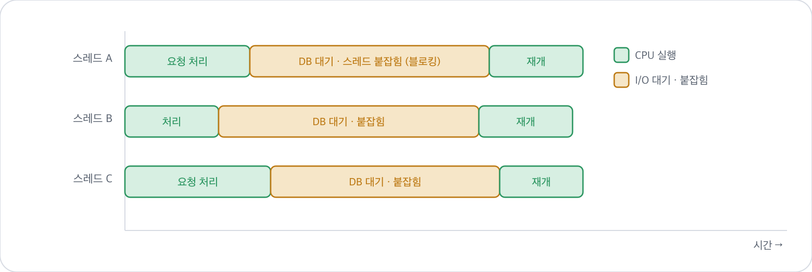
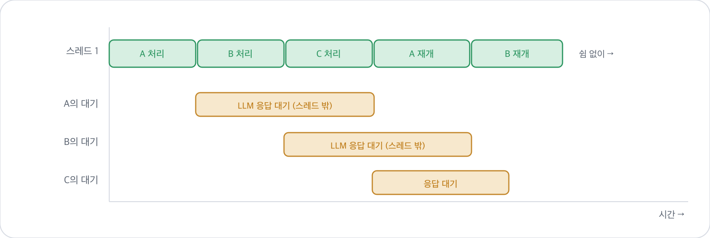
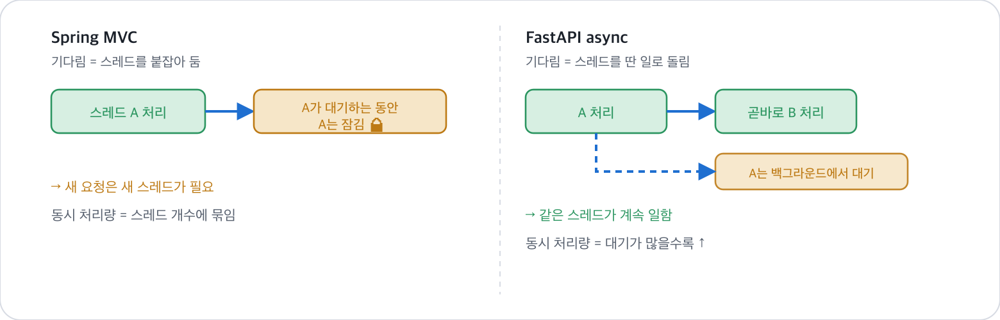

# 하드웨어 위의 백엔드

> 요청 하나가 랜카드에서 출발해 버스와 메모리를 지나 CPU에 닿기까지 —
> 그리고 그 여행의 마지막 한 순간에서 **Spring Boot**와 **FastAPI**가 완전히 갈라지는 이유.
>
> (웹 버전: 다이어그램이 있는 아티팩트로도 있음)

**연결:** CSAPP 1.4 → 실무 · **예제:** WeCam · speaknote · 도깨비

### 목차
1. [웹서버도 결국 프로세스 하나다](#01-웹서버도-결국-프로세스-하나다)
2. [하드웨어 지도 — 버스와 I/O 브릿지](#02-하드웨어-지도--버스와-io-브릿지)
3. [요청이 CPU에 닿기까지 (공통 경로)](#03-요청이-cpu에-닿기까지-공통-경로)
4. [Spring Boot — 요청마다 일꾼 한 명](#04-spring-boot--요청마다-일꾼-한-명)
5. [FastAPI — 일꾼 하나가 여러 냄비를](#05-fastapi--일꾼-하나가-여러-냄비를)
6. [단 하나의 차이, 나란히 보기](#06-단-하나의-차이-나란히-보기)
7. [그래서 언제 무엇을 쓰나](#07-그래서-언제-무엇을-쓰나)

---

## 01. 웹서버도 결국 프로세스 하나다

`java -jar app.jar` 든 `uvicorn app.main:app` 이든, 서버를 켠다는 건 특별한 일이 아니다.
앞 절에서 본 그것 — **디스크의 코드를 메모리로 올려, CPU가 인스트럭션을 하나씩 읽어 실행하는 프로세스를 하나 만드는 일**이다.

웹서버가 보통 프로그램과 다른 점은 딱 하나다. 계산을 끝내고 종료하는 대신,
**소켓을 열어두고 요청이 오기를 무한히 기다린다.** 즉 웹서버 = "죽지 않고 네트워크를 계속 읽는 프로세스"다.

> **이 글의 목적지**
> Spring Boot(스레드 풀)와 FastAPI(이벤트 루프)는 흔히 "철학이 다르다"고 뭉뚱그려진다.
> 하지만 하드웨어까지 내려가 보면, 둘의 본질적 차이는 아주 좁은 한 순간 —
> **"I/O를 기다리는 동안 CPU와 스레드가 무엇을 하는가"** — 에만 있다.
> 나머지는 전부 똑같다. 그 한 순간을 눈으로 보는 게 목표다.

---

## 02. 하드웨어 지도 — 버스와 I/O 브릿지

부품들은 아무렇게나 이어져 있지 않다. 속도가 비슷한 것끼리 묶어 **여러 층의 버스(bus)** 로 연결하고,
그 사이에 **I/O 브릿지**라는 교차로를 둔다. 브릿지는 빠른 쪽(CPU·메모리)과 느린 쪽(키보드·디스크·랜카드)을 중계하는 나들목이다.



*버스 계층 지도 — CPU·메모리는 빠른 시스템·메모리 버스로, 느린 장치는 I/O 버스로 I/O 브릿지에 연결. NIC(랜카드)도 I/O 버스에 붙은 장치일 뿐이다.*

> **세 층의 버스.** CPU와 메모리는 짧고 빠른 **① 시스템 버스 · ② 메모리 버스**로 직접 오간다.
> 느린 장치는 **③ I/O 버스**에 매달리고, **I/O 브릿지**가 두 세계를 중계한다.
> 백엔드에서 중요한 점 하나 — **NIC(랜카드)도 결국 I/O 버스에 붙은 장치**일 뿐, 키보드·디스크와 같은 계층이다.

**왜 층을 나눴나?** 부품마다 속도가 천차만별이라, 빠른 것과 느린 것을 한 줄에 묶으면 전체가 느린 쪽에 발목 잡힌다.

```
빠름 ────────────────────────────────────────────────▶ 느림
레지스터   »   메모리(DRAM)   »»   디스크(SSD)   »»»   네트워크
```

이 **속도 계층**이 뒤에 배울 캐시(메모리 계층구조)의 출발점이기도 하다.

---

## 03. 요청이 CPU에 닿기까지 (공통 경로)

이제 내 서버에 HTTP 요청이 하나 도착한다. Spring이든 FastAPI든 **여기까지의 길은 완전히 똑같다.**



*요청 도착 흐름 — DMA는 CPU를 거치지 않고 장치→메모리로 직접 옮기고, 완료되면 인터럽트로 CPU에 알린다.*

> **두 개의 하드웨어 트릭이 핵심이다.**
> - **DMA(Direct Memory Access):** 데이터를 **CPU를 거치지 않고** 장치→메모리로 직접 실어 나른다.
> 느린 운반은 전담 일꾼에게 맡기고 CPU는 딴 일을 한다.
> - **인터럽트:** 운반이 끝나면 컨트롤러가 CPU를 톡 쳐서 "도착했다"고 알린다.
>
> 이 **DMA + 인터럽트** 짝은 뒤에서 두 프레임워크가 갈라질 때 그대로 다시 등장한다.

> **백엔드로 번역하면**
> "DB가 느리다"는 말의 하드웨어적 실체는 **느린 I/O 버스 너머 디스크까지 왕복해야 한다**는 뜻이다.
> Redis 캐시가 빠른 이유는 그 왕복을 생략하고 **빠른 메모리 버스 안에서 끝내기** 때문 —
> "느린 디스크 대신 빠른 메모리를 쓴다"는 1장 원리의 실무판이다.

---

## 04. Spring Boot — 요청마다 일꾼 한 명

요청이 메모리에 도착했다. Spring Boot(MVC)는 톰캣 **스레드 풀**에서 일꾼(스레드) 하나를 꺼내
이 요청에 통째로 배정한다. 그 스레드가 처음부터 끝까지 책임진다.

```java
@GetMapping("/users/{id}")
public User getUser(@PathVariable Long id) {
    return userRepository.findById(id)   // DB까지 왕복 — 느리다
                         .orElseThrow();
}
```

문제는 `findById()`가 DB 응답을 기다리는 동안 벌어진다.
**그 스레드는 "블로킹" 상태로 멈춰 선다.** CPU는 잠시 다른 스레드로 갈아타지만,
이 스레드 자체는 요청 전용으로 계속 붙잡혀 있다 — **스택 메모리까지 점유한 채**.



*Spring Boot(MVC) — 요청 3개 = 스레드 3개. 노란 구간(DB 대기) 동안 그 스레드가 통째로 붙잡혀 논다.*

> **요청 3개 = 스레드 3개.** 노란(░) 구간 동안 그 스레드는 아무 일도 못 하면서 자리를 계속 차지한다.
> 동시 요청 1000개면 스레드 1000개 — **스택 메모리 1000개분과 문맥 교환 비용**이 그대로 든다.
> 스레드 풀(기본 200)이 차면 나머지는 큐에서 대기한다.

**장점은 분명하다.** 코드가 위에서 아래로 그냥 읽힌다(동기). 트랜잭션·예외 처리가 직관적이고,
JPA 같은 성숙한 생태계가 이 모델 위에 잘 얹혀 있다. **WeCam의 Spring MVC 백엔드가 정확히 이 방식**이다.

---

## 05. FastAPI — 일꾼 하나가 여러 냄비를

FastAPI는 접근이 다르다. **스레드 하나**가 **이벤트 루프**를 돌리며 수많은 요청을 번갈아 처리한다.
마치 요리사 한 명이 여러 냄비를 동시에 돌보듯이.

```python
@router.post("/recommend")
async def recommend(req: Req):
    async with llm_semaphore:              # 동시 N개까지만 통과
        result = await call_llm(req.prompt)   # 기다리는 동안 자리 비켜줌
    return result
```

핵심은 `await`다. LLM 응답을 기다려야 하는 순간, **스레드는 멈추지 않는다.**
"요청 A는 대기 중"이라고 메모(코루틴 상태)만 남기고, **같은 스레드가 곧바로 요청 B, C로 옮겨간다.**
응답이 도착하면(인터럽트) 루프가 "아 A 왔네" 하고 이어서 마무리한다.



*FastAPI(async) — 스레드 1개 레인은 초록으로 꽉 차고, 각 요청의 대기는 스레드가 아니라 백그라운드에서 진행된다.*

> **스레드 레인은 초록(▓)으로 꽉 찬다.** 각 요청의 노란(░) "대기"는 스레드가 아니라
> **백그라운드(하드웨어 I/O)에서 진행**되고, 그 시간에 스레드는 다른 요청을 처리한다.
> 그래서 동시 요청이 1000개라도 **스레드는 하나(+워커 몇 개)** 면 충분하다 — 스택 메모리도, 문맥 교환도 거의 없다.

> **도깨비-ai의 llm_semaphore**
> 이벤트 루프는 요청을 무한정 받아들일 수 있다. 하지만 LLM 동시 호출이 너무 많으면 외부 API 한도나 메모리가 터진다.
> **세마포어는 "동시에 N개까지만 통과"시키는 게이트**로, 이 무한 동시성을 의도적으로 제한한다 —
> OS의 동기화 개념을 백엔드에서 그대로 쓰는 실제 예다.

**단점도 있다.** `await` 없이 **무거운 CPU 계산**을 루프 안에서 하면, 그동안 다른 요청이 전부 멈춘다
(요리사가 한 냄비만 붙들고 있는 꼴). 그래서 **WeCam의 OCR** 같은 CPU 바운드 작업은
이벤트 루프가 아니라 프로세스/워커로 빼야 한다.

---

## 06. 단 하나의 차이, 나란히 보기

두 모델은 **똑같은 버스, 똑같은 DMA, 똑같은 인터럽트**를 쓴다.
갈라지는 건 오직 **"I/O를 기다리는 그 순간"** 하나뿐이다.



*단 하나의 차이 — I/O 대기 순간, Spring은 스레드를 붙잡아 두고() FastAPI는 같은 스레드를 다음 요청으로 돌린다.*

> **이것이 전부다.** I/O 대기 순간 — Spring MVC는 그 스레드를 **붙잡아 두고**(요청 수만큼 스레드 필요),
> FastAPI는 같은 스레드를 **다음 요청으로 돌린다**(하나로 버틴다). 나머지 하드웨어 동작은 완전히 동일하다.

| | **스레드 풀** (Thread-per-request) | **이벤트 루프** (Event loop) |
|---|---|---|
| 처리 방식 | 요청마다 스레드 하나 배정, 대기 중엔 블로킹 | 스레드 하나가 대기 시간마다 다른 요청으로 이동 |
| 코드 | 동기 → 읽기·디버깅·트랜잭션 직관적 | async/await → 흐름 추적 어려움 |
| 비용 | 스레드 늘수록 메모리·문맥교환 ↑ | 적은 스레드로 많은 동시 요청, 메모리 효율적 |
| 위험 | 스레드 풀 고갈 시 큐 대기 | 무거운 CPU 계산이 루프를 막음 |
| 예시 | **Spring MVC**(WeCam) · Flask(+gunicorn) | **FastAPI**(도깨비) · NestJS · Spring **WebFlux**(speaknote) |

> **중요 — 모델은 언어가 아니라 선택이 정한다**
> 같은 Java/Spring이라도 **MVC(스레드 풀)** 와 **WebFlux(이벤트 루프, Netty 기반)** 를 고를 수 있다.
> speaknote가 `starter-web`과 `starter-webflux`를 함께 넣은 이유가 이것 —
> 실시간·스트리밍엔 이벤트 루프형이 유리하기 때문이다. "Spring = 무조건 스레드 풀"이 아니다.

---

## 07. 그래서 언제 무엇을 쓰나

모든 판단은 한 질문으로 수렴한다 — **이 일은 "기다리는 일(I/O)"인가, "계산하는 일(CPU)"인가?**

| 작업 성격 | 예 (내 프로젝트) | 맞는 모델 | 이유 |
|---|---|---|---|
| **I/O 바운드**<br>기다림 많음 | LLM 호출(도깨비-ai), DB·Redis 조회, 소켓 | **이벤트 루프**<br>FastAPI · WebFlux · Nest | 기다리는 시간에 딴 요청 처리 → 스레드 낭비 X |
| **CPU 바운드**<br>계산 많음 | OCR(WeCam-ai), 이미지·영상 처리, 대규모 연산 | **멀티 프로세스**<br>워커 여러 개 | 코어를 꽉 채워 병렬 계산 · 루프 막힘 방지 |
| **복잡한 트랜잭션**<br>성숙한 생태계 | 결제·정산·권한(WeCam · speaknote) | **스레드 풀**<br>Spring MVC | 동기 코드라 흐름 직관적 · JPA·트랜잭션 성숙 |

하드웨어로 되돌리면 이렇게 정리된다.
- **I/O 바운드**는 CPU가 놀면서 네트워크·디스크를 기다리는 상태 — 스레드를 붙잡아 두면 낭비이니 이벤트 루프에 양보한다.
- **CPU 바운드**는 CPU 자체가 병목이니 — 코어 수만큼 프로세스를 돌려 물리적으로 병렬화하는 수밖에 없다.

결국 "스레드를 늘릴까 · 프로세스를 늘릴까 · 비동기로 바꿀까"라는 아키텍처 결정은,
**이 작업이 CPU를 쓰는지 기다리는지**에서 갈린다.
1장의 CPU·메모리·디스크·버스 개념이, 그대로 서버 설계의 근거가 되는 셈이다.

> **한 문장으로**
> 요청은 늘 같은 하드웨어 길(NIC → 버스 → I/O 브릿지 → 메모리 → CPU)을 지난다.
> **프레임워크가 정하는 건 오직 하나 — I/O를 기다리는 그 순간, 일꾼을 붙잡아 둘 것인가 딴 일에 돌릴 것인가.**

---

*컴퓨터 시스템 1장 학습 노트 · 하드웨어 조직 → 백엔드 동시성*
*참고 스택 — WeCam(Spring MVC · OCR) · speaknote(Spring MVC+WebFlux · Flask) · 도깨비(NestJS · FastAPI)*
